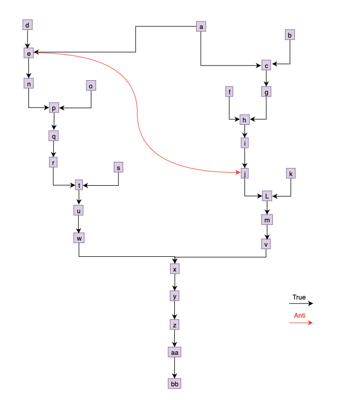

# Assignment 1

## Problem 1 - ILOC code shape

#### 1. All variables may be aliased

```
code
```

#### 2. Variables a and b, and c and d may be aliased. However, both a and b are not aliased with c or d. Memory consistency has to be preserved.

```
code
```

#### 3. No two variables are aliased. Memory consistency has to be preserved

```
code
```

#### 4. No two variables are aliased. Memory consistency may not be preserved

```
code
```

## Problem 2 - Anti-Dependencies

Assuming the following latencies (from Lecture 4)

```
load = 3
loadI = 1
loadAI = 3
store = 3
storeAI = 3
add = 1
mult = 2
fadd = 1
fmult = 2
shift = 1
output = 1
outputAI = 1
```

#### 1. What is the number of cycles needed to run this code assuming the latencies used in class (see lecture 3)? Do not reorder the instructions?

- a takes 1 cycle
- b takes 1 cycle
- c takes 3 cycles
- d takes 1 cycle
- e takes 3 cycles
- f takes 3 cycles
- g takes 1 cycle
  - g can be pipelined directly after f, since it has no dependencies to f. Therefore, it will only take 1 additional cycle (2/3 of g will be pipelined with f)
- h takes 1 cycle
- i takes 3 cycles
- j takes 1 cycle

**It takes a total of 18 cycles for this code to run**

> Note: I'm assuming we are allowed to pipeline g with f, if not then this will take 20 cycles not 18.

#### 2. Can you remove the anti dependencies? If so, give the code. What is the number of cycles needed to run the modified code without anti-dependencies using latencies above. Do not reorder or eliminate any instructions?

To remove the first anti-dependency, we can change `d` to use `r4` instead of `r1`, also making sure to update `e` to `store r4 => ...`. To get rid of of the other anti-dependency, we also change `f` to loading into `r5` instead of `r1`, also making sure to update `h` to use `r5` instead of `r1`.

Modified code:

```
a   loadI   1024  => r0
b   loadI   2     => r1
c   storeAI r1    => r0, 4
d   loadI   3     => r4
e   storeAI r4    => r0, 8
f   loadAI  r0, 4 => r5
g   loadAI  r0, 8 => r2
h   add     r5, r2 => r3
i   storeAI r3    => r0, 12
j   outputAI r0, 12
```

The number of cycles needed to run the modified code is actually the same as the original code, since even though we got rid of the anti-dependencies, we didn't reorder any instructions and are just using different registers.

#### 3. What are the advantages and disadvantages of removing anti-dependencies?

One of the most clear advantages of removing anti-dependencies is that it removes constraints on the reordering of instructions for the compiler's instruction scheduler.

One clear disadvantage of removing anti-dependencies is the increased demand for registers. Renaming registers to remove anti-dependencies increase the demand for registers, potentially forcing the register allocator to spill more values. Spilling these values into memory can cause very (relatively) long latency operations by having to access the memory when there are more named registers than actual registers on that particular architecture.

## Problem 3 - Instruction Scheduling

```
a   loadI 1024  => r0
b   loadI 0 =>r1
c   storeAI r1  => r0, 0
d   loadI 63  => r3
e   storeAI r3  => r0, 4
f   loadI 5 =>r5
g   loadAI r0, 0  => r6
h   add r5,r6 =>r7
i   storeAI r7  => r0, 8
j   loadAI r0, 8  => r3
k   loadI 9  => r10
l   sub r3, r10  => r11
m   storeAI r11  => r0, 12
n   loadAI r0, 4  => r13
o   loadI 3  => r14
p   mult r13, r14  => r15
q   storeAI r15  => r0, 16
r   loadAI r0, 16  => r3
s   loadI 7  => r18
t   mult r3, r18  => r4
u   storeAI r4  => r0, 20
v   loadAI r0, 12  => r21
w   loadAI r0, 20  => r22
x   add r21, r22  => r23
y   storeAI r23  => r0, 24
z   loadAI r0, 24  => r25
aa  storeAI r25  => r0, 28
bb  outputAI r0, 28
```

#### 1. Show the assignment S(n) of instruction issue times to instructions when no list scheduling is performed. How many cycles does the program take?

Assuming we can pipeline instructions:

- a = S(0)
- b = S(1)
- c = S(2) (r1 and @0 can't be used until S(5))
- d = S(3)
- e = S(4) (r3 and @4 can't be used until S(7))
- f = S(5)
- g = S(6) (r6 can't be used until S(9))
- h = S(9)
- i = S(10) (r7 and @8 can't be used until S(13))
- j = S(13) (r3 and @8 can't be used until S(16))
- k = S(14)
- l = S(16) (assuming sub is 1 cycle)
- m = S(17) (r11 and @12 can't be used until S(20))
- n = S(18) (@4 and r13 can't be used until S(21))
- o = S(19)
- p = S(21) (r15 can't be used until S(23))
- q = S(23) (r15 and @16 can't be used until S(26))
- r = S(26) (@16 and r3 can't be used until S(29))
- s = S(27)
- t = S(29) (r4 can't be used until S(31))
- u = S(31) (r4 and @20 can't be used until S(34))
- v = S(32) (r21 and @12 can't be used until S(35))
- w = S(34) (r22 and @20 can't be used until S(37))
- x = S(37)
- y = S(38) (r23 and @24 can't be used until S(41))
- z = S(41) (r25 and @24 can't be used until S(44))
- aa = S(44) (@28 can't be used until S(47))
- bb = S(47)

The program takes a total of 48 cycles (since outputAI is scheduled on the 47th cycle and takes 1 cycle to finish)

#### 2. Show the dependency graph for the basic block

<p align="center">
  
</p>
